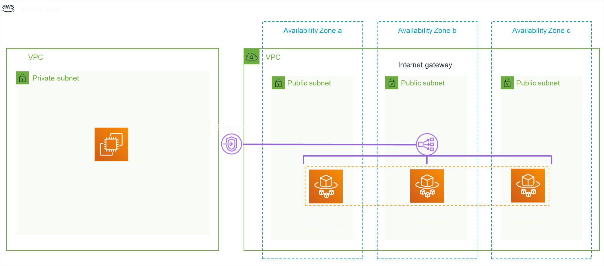

# Re:Invent 2019 ARC321  Builders Workshop
## Enabling AWS PrivateLink with the AWS Cloud Development Kit
---
## Overview

AWS PrivateLink provides private network access to AWS services and your own SaaS-style services. In this solution, learn how to use the AWS Cloud Development Kit ([CDK](https://aws.amazon.com/cdk/)) to create a reusable component that sets up a proxy layer for resources that don’t natively support AWS PrivateLink.

You will need an AWS account to complete this soluton.  In this example, we will be using [Cloud9](https://aws.amazon.com/cloud9/)  as our development enviornment.   If you would like to use a local development enviornment and need guidance with setting up permission, please refer to the [AWS CLI Guide](https://docs.aws.amazon.com/cli/latest/userguide/cli-chap-configure.html)


## Getting Started
If you do not have an existing Cloud9 environment go ahead and set one up following the [AWS Cloud9  Cloud Based IDE QuickStart](https://aws-quickstart.s3.amazonaws.com/quickstart-cloud9-ide/doc/aws-cloud9-cloud-based-ide.pdf)  

Once you have started your Cloud9 enviornment, please run the following command in the terminal pane to install the CDK toolkit and the SDK references we will be using

`npm install -g aws-cdk`


Now we are ready to start building the solution.

Here is the architecture diagram of what we will to be building with CDK:  

  

Let's create a working directory and to clone our repository in our Cloud9 instance with with the following commands.

```bash
mkdir cdk-workshop && cd cdk-workshop`
git clone https://github.com/aws-samples/reinvent2019-arc321-builders-workshop.git`
cd reinvent2019-arc321-builders-workshop
npm install
```

Now that we have our code in our working directory, let's start opening the [lib/aws_endpoint_proxy_cdk-stack.ts](lib/aws_endpoint_proxy_cdk-stack.ts) file in our IDE.  

As you can see this file only contains comments on where we will be adding code.

## Module 1 - Build a sample Fargate application with customizable components behind a Network Load Balancer
<details>
<summary><strong>Click to expand!</strong></summary><p>

### Build network resources

#### VPC
Lets start by adding the following code to VPC section.  This code will create a VPC in your current region.  

```typescript
const vpc = new ec2.Vpc(this, "SquidVPC", {
  cidr: "10.0.0.0/24", // CIDR of the desired VPC
  maxAzs: 3 // Default is all AZs in region
});
```

#### Security Group

Next we will add a Security Group to control access to our Fargate Task.  

```typescript
const securityGroup = new ec2.SecurityGroup(this, "TaskSecurityGroup", {
  vpc: vpc
})
securityGroup.addIngressRule(ec2.Peer.ipv4("192.168.0.0/16"), ec2.Port.tcp(80))
securityGroup.addIngressRule(ec2.Peer.ipv4("172.16.0.0/12"), ec2.Port.tcp(80))
securityGroup.addIngressRule(ec2.Peer.ipv4("10.0.0.0/8"), ec2.Port.tcp(80))
```

#### Network Load Balancer

Next let's create a Network Load Balancer for our solution. 

```typescript
const loadBalancer = new elb.NetworkLoadBalancer(this, "AWSEndpointProxyNetworkLoadBalancer", {
  vpc: vpc,
  crossZoneEnabled: true,
  internetFacing: true // Default is false
})
```

#### Target Group

The next thing we need is a TargetGroup associated with our Network LoadBalancer we have already defined.

```typescript
const targetGroupSquid = new elb.NetworkTargetGroup(this, "NetworkTargetGroupSquid", {
  port: 80,
  vpc: vpc,
  targetType: elb.TargetType.IP
});
```

#### Listeners - 80

Next step we add a few listeners to our NLB / TargetGroup definitions. 

```typescript
const networkListener80 = new elb.NetworkListener(this, "NetworkListenerHTTP", {
  loadBalancer: loadBalancer,
  port: 80
});

networkListener80.addTargetGroups("DefaultTargetGroup", targetGroupSquid)

```

### Fargate application

#### ECS Cluster
Next we will add code to instanciate our ECS cluster.

```typescript
const cluster = new ecs.Cluster(this, "AWSEndpointProxyCluster", {
  vpc: vpc
});
```

#### Docker Image
In this first module, we'll deal with a sample image: 'amazon/amazon-ecs-sample'

```typescript
const imageUri = "amazon/amazon-ecs-sample"
```

#### Fargate Task

Next we need to add a Fargate Task definition. 

```typescript
const fargateTaskDefinition = new ecs.FargateTaskDefinition(this, "AWSEndpointProxyFargateTaskDefinition", {
        memoryLimitMiB: 512,
        cpu: 256
});
```

#### Application Container

Next we add a new App Container

```typescript
const appContainer = fargateTaskDefinition.addContainer("Container", {
        image: ecs.ContainerImage.fromRegistry(imageUri)
});

appContainer.addPortMappings({
        containerPort: 80
});
```

#### Fargate Service

Now we can create our Fargate service  


```typescript
const fargateService = new ecs.FargateService(this, "AWSEndpointProxyFargateService", {
  cluster: cluster,
  desiredCount: 2,
  taskDefinition: fargateTaskDefinition,
  securityGroup: securityGroup
});
```

And we can add the network target group we have created for our load balancer to our FargateService component:  

```typescript
fargateService.attachToNetworkTargetGroup(targetGroupSquid)
```

#### Autoscaling Capabilities

Let's add some autoscaling capabilities to our service

```typescript
const scaling = fargateService.autoScaleTaskCount({
  minCapacity: 2,
  maxCapacity: 10 
});

scaling.scaleOnCpuUtilization('CpuScaling', {
  targetUtilizationPercent: 50,
  scaleInCooldown: cdk.Duration.seconds(10),
  scaleOutCooldown: cdk.Duration.seconds(10)
});
```

### Putting it all together!

 Ok now that we have all our code complete, save your work and deploy you're ready to deploy.
 
 using the following commands to Build and deploy your solution.
 
```bash
npm run build
cdk bootstrap
cdk synth
cdk deploy
```
 
That's it we're done! It will take a few minutes for your stack to create and deploy...

</details>

## Module 2 - Customize our Fargate application to run a Squid Proxy on AWS API endpoints
<details>
<summary><strong>Click to expand!</strong></summary><p>

Here we want to deal with a squid server instead of the sample app we created in module 1

### Build network resources

#### Security Group

As Squid works with port 3128, we'll change our code so that our security group listen to port 3128 instead of 80.

#### Target Group

Same for our target group. We can edit its port and replace it with the one we need.

#### Listeners - 80 - 443

We want our proxy to listen to port 443 in addition to port 80. So create a networkListener443 resource and add it to our `targetGroupSquid` resource

### Fargate application

#### Docker Image

Previously, we have taken an already published image from Docker Hub (`amazon/amazon-ecs-sample`).  
Here, we'll deal with a customized image of Squid that will filter any URL that are not from an `amazonaws.com` endpoint.  
We will be using the docker file located in the docket-image directory [docker-image/dockfile](docker-image/dockfile).  
To do so, we suggest to replace the previously defined `const imageUri = "amazon/amazon-ecs-sample"` with the following code:  

```typescript
const __dirname = path.resolve();
const dockerImageAsset = new DockerImageAsset(this, "AWSEndpointProxyDockerImageAsset", {
  directory: path.join(__dirname, 'docker-image'),
});
const imageUri = dockerImageAsset.imageUri
```

#### Application Container

Please, change the containerPort in the appContainer port mapping to `3128` instead of `80`

#### Execution Role

Next we need to update the Execution Role with access granting to the `dockerImageAsset` ECR repository.

```typescript
const executionRole = fargateTaskDefinition.obtainExecutionRole()
dockerImageAsset.repository.grantPull(executionRole.grantPrincipal)
```

### Custom VPC Endpoint
Finally we want to mount our proxy as a VPC Endpoint Configuration

```typescript
const createVpcEndpointServiceConfiguration = new AwsCustomResource(this, 'CreateVpcEndpointServiceConfiguration', {
  onUpdate: { // will also be called for a CREATE event
    service: 'EC2',
    action: 'createVpcEndpointServiceConfiguration',
    parameters: {
      NetworkLoadBalancerArns: [loadBalancer.loadBalancerArn],
      AcceptanceRequired: false
    },
    physicalResourceIdPath: 'ServiceConfiguration.ServiceId'
  }
});
```

### Putting it all together again!

 Ok now that we have all our code complete, save your work and deploy you're ready to deploy.
 
 using the following commands to Build and deploy your solution.
 
```bash
npm run build
cdk deploy
```
 
That's it we're done! It will take a few minutes for your stack to update and deploy...

</details>

## Module 3 - Testing the solution
<details>
<summary><strong>Click to expand!</strong></summary><p>

Once the stack is deployed, run ``aws ec2 describe-vpc-endpoint-services --query 'ServiceDetails[?Owner!=`amazon`]'`` in order to get the endpoint Service name.  
Open the VPC console and select the `Endpoints` section on the left.  
Click on `Create Endpoint`, toggle `Find service by name`, paste your endpoint service name in the private service name field, and click on `Verify`.  
Select the VPC where you have your Cloud9 instance running, and validate the creation of the endpoint.  

While your endpoint is being created, go the the EC2 console, and add the Default security group to your Cloud9 instance.  

Wait for your Endpoint to be created.  

To test your proxy from a private VPC, we should connect to a private instance and apply the following proxy configuration.  
However, we can emulate this behaviour from our Cloud9 instance, doing the following:  
```bash
export http_proxy=vpce-xxxxxxxxxxx-xxxxxxxxxxxx.vpce-svc-xxxxxxxxxxxxxxx.us-west-2.vpce.amazonaws.com:80
export https_proxy= vpce-xxxxxxxxxxx-xxxxxxxxxxxx.vpce-svc-xxxxxxxxxxxxxxx.us-west-2.vpce.amazonaws.com:443
export NO_PROXY=169.254.169.254
```
And do something like `aws s3 ls s3://[name_of_one_of_your_bucket]` (considering the instanceRole of your instance has the right S3 policy of course)

</details>

## References for CDK components to be used within our session

 * [Vpc](https://docs.aws.amazon.com/cdk/api/latest/docs/@aws-cdk_aws-ec2.Vpc.html)
 * [SecurityGroup](https://docs.aws.amazon.com/cdk/api/latest/docs/@aws-cdk_aws-ec2.SecurityGroup.html)
 * [DockerImageAsset](https://docs.aws.amazon.com/cdk/api/latest/docs/@aws-cdk_aws-ecr-assets.DockerImageAsset.html)
 * [Cluster](https://docs.aws.amazon.com/cdk/api/latest/docs/@aws-cdk_aws-ecs.Cluster.html)
 * [FargateTaskDefinition](https://docs.aws.amazon.com/cdk/api/latest/docs/@aws-cdk_aws-ecs.FargateTaskDefinition.html)
 * [FargateService](https://docs.aws.amazon.com/cdk/api/latest/docs/@aws-cdk_aws-ecs.FargateService.html)
 * [NetworkLoadBalancer](https://docs.aws.amazon.com/cdk/api/latest/docs/@aws-cdk_aws-elasticloadbalancingv2.NetworkLoadBalancer.html)
 * [NetworkTargetGroup](https://docs.aws.amazon.com/cdk/api/latest/docs/@aws-cdk_aws-elasticloadbalancingv2.NetworkTargetGroup.html)
 * [NetworkListener](https://docs.aws.amazon.com/cdk/api/latest/docs/@aws-cdk_aws-elasticloadbalancingv2.NetworkListener.html)
 * [AwsCustomResource](https://docs.aws.amazon.com/cdk/api/latest/docs/@aws-cdk_custom-resources.AwsCustomResource.html)

## License

This library is licensed under the MIT-0 License. See the LICENSE file.

